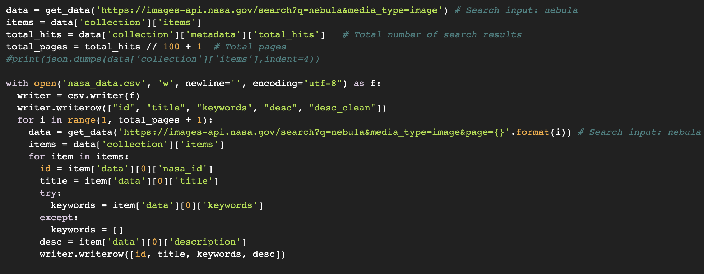
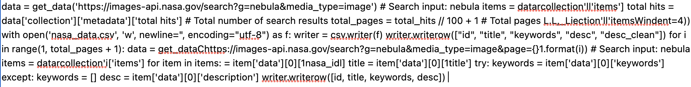
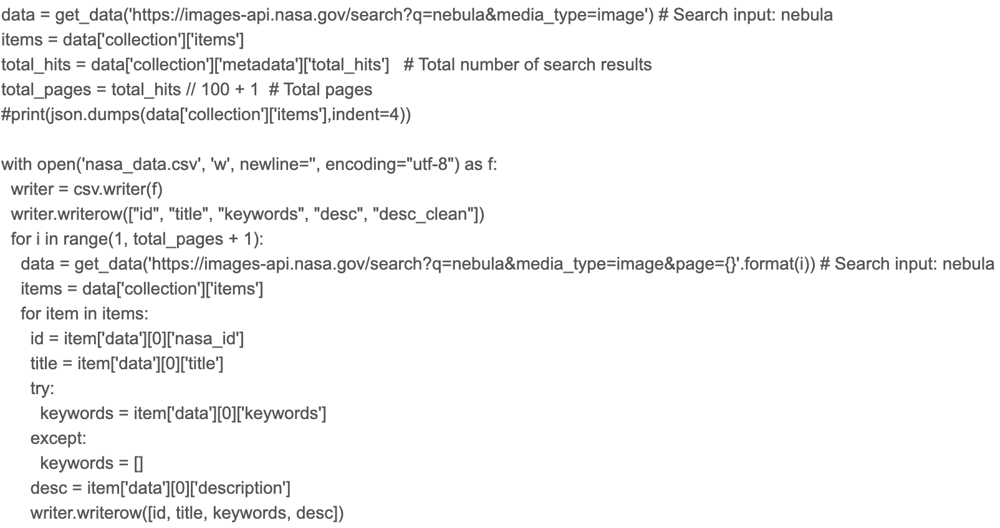

# Screenshot2Code (S2C) - OCR for Code Screenshots!

**In a nutshell**:  
Use Screenshot2Code to convert code screenshots to text while preserving its format and steering clear of clipboard limitations!

Why is Screenshot2Code needed? Check out this [Medium article](https://medium.com/dxdr/screenshot2code-s2c-ocr-for-code-screenshots-be5de6a0b961).

## Screenshot2Code vs. Existing Methods

#### Conventional Copy-Paste
> Show visual (.gif) of copying/pasting code across two platforms that causes loss of information.

#### Conventional OCR

This is a code snippet from a typical data science program.

&darr;  &nbsp; &darr;  &nbsp; &darr;  &nbsp; &darr;  &nbsp; &darr;  &nbsp; &darr;  &nbsp; &darr;  &nbsp; &darr;  &nbsp; &darr;  &nbsp; &darr;  &nbsp; &darr;  &nbsp; &darr;  &nbsp; &darr;  &nbsp; &darr;  &nbsp; &darr;  &nbsp; &darr;  &nbsp; &darr;  &nbsp; &darr;  &nbsp; &darr;  &nbsp; &darr;  &nbsp; &darr;  &nbsp; &darr;  &nbsp; &darr;  &nbsp; &darr;  &nbsp; &darr;  &nbsp; &darr;  &nbsp; &darr;  &nbsp; &darr;  &nbsp; &darr;  &nbsp; &darr;  &nbsp; 
&darr;  &nbsp; &darr;  &nbsp; &darr;  &nbsp; &darr;

&darr;  &nbsp; &darr;  &nbsp; &darr;  &nbsp; &darr;  &nbsp; &darr;  &nbsp; &darr;  &nbsp; &darr;  &nbsp; &darr;  &nbsp; &darr;  &nbsp; &darr;  &nbsp; &darr;  &nbsp; &darr;  &nbsp; &darr;  &nbsp; &darr;  &nbsp; &darr;  &nbsp; &darr;  &nbsp; &darr;  &nbsp; &darr;  &nbsp; &darr;  &nbsp; &darr;  &nbsp; &darr;  &nbsp; &darr;  &nbsp; &darr;  &nbsp; &darr;  &nbsp; &darr;  &nbsp; &darr;  &nbsp; &darr;  &nbsp; &darr;  &nbsp; &darr;  &nbsp; &darr;  &nbsp; 
&darr;  &nbsp; &darr;  &nbsp; &darr;  &nbsp; &darr;

As shown above, the output is not only totally misformatted Python code - it's also unrunnable.

#### Screenshot2Code
> Show visual (.gif) of Screenshot2Code converting screenshot into formatted code.

Why is Screenshot2Code needed?
- Existing frameworks, libraries, and APIs tend to fall into one of two categories: (1) proprietary and closed-source or (2) open-source but designed for images and not particularly code.
- Generative AI - why not just ask AGI to do it?
  - **GPT-4** can handle image modalities, but it is not accessible to everyone and it is not specialized for this purpose
  - **ChatGPT** does not accept image input.
  - **Google Bard** as of its initial release cannot handle image modalities.
  - **Github CoPilot** cannot handle image modalities.
  - **Codex** cannot handle image modalities.

To the best of our knowledge, there are currently no open-source repositories or APIs that are specifically designed for converting a screenshot into code in a way that preserves syntactical information such as spacing, indentation, and newlines. While there are many OCR and ML tools that can recognize text and generate text from images such as OpenCV or [Pytesseract](https://github.com/madmaze/pytesseract), these tools are not specifically designed for code recognition and may not be able to preserve formatting and syntax information to the extent required for complex code.

## TODO
- [ ] Fix the remainder of indentation issues (current post-processing method isn't comprehensive)
- [ ] Detect whether the screenshot is code or just text
- [ ] Train custom deep learning model for better and more customizable of OCR
- [ ] Eliminate line numbers and other irrelevant information
- [ ] Copy submitted code to clipboard

## Screenshot Formats
Screenshots almost always come in one of two formats depending on the OS.
- **macOS**, **Ubuntu**, and other Linux-based OS's: .png
- **Windows**: .jpg, .jpeg

## Languages we Support
We support all 54 languages included in the Guesslang Python package, including Python, C, Shell, etc.

#### Authorship
This project is led by [Seth Harding](https://linkedin.com/in/SethHasi) and [Matthieu Desir](github.com/matdexir).  
For more information or to find out how to contribute to Screenshot2Code, please send an email! seth@dragonx.ai or matthieudesir@gmail.com
